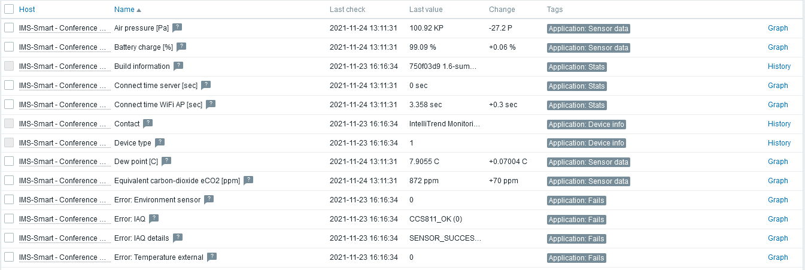

# IMS-Smart Sensor templates for Zabbix

This repository contains Zabbix template files for the [IntelliTrend IMS-Smart sensor](https://www.intellitrend.de/cms/en/intellimon/ims-smart-sensors/).

## Requirements

* Zabbix 5.0 or higher

## Template files

| IMS-Smart version | Template file                                                |
| ----------------- | ------------------------------------------------------------ |
| 1.6               | [IMS-Smart_Sensor_v1.6.xml](./templates/IMS-Smart_Sensor_v1.6.xml) |

## License

This software is licensed under the GNU Lesser General Public License v3.0.

## Examples

### Example items

### Example data

### Example dashboard

